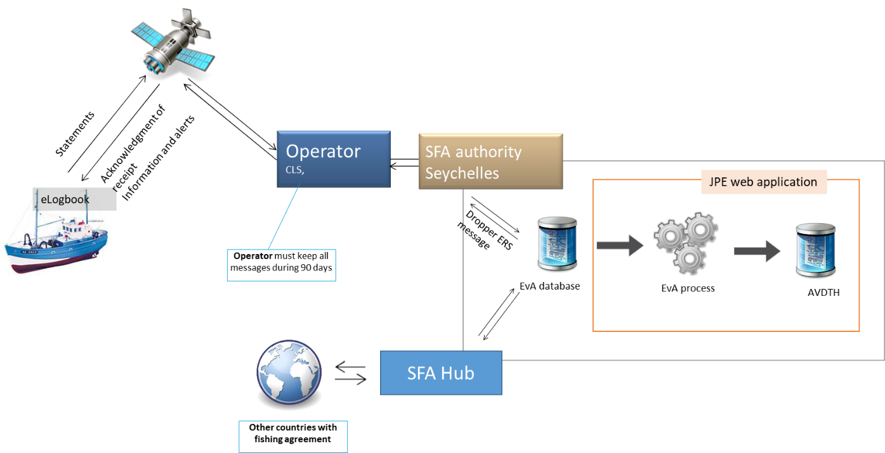

.. ERS Dropper for Seychelles documentation master file, created by
   sphinx-quickstart on Fri Nov  8 17:21:18 2019.

ERS Dropper for Seychelles's documentation!
===========================================

.. meta::
   :keywords: ERS injector seychelles purse-seiners tuna 
   :description lang=en: Injector of data from the fishing logbook of seychelles purse seiners.
   

Introduction
============

Context
-------
SFA is setting up an electronic logbook on the Seychelles flagged purse seiners fleet. The purpose of the software, **FISHLog**, is to collect fishing data on board these vessels to replace the fishing logbook in paper format. All data are integrated into the SFA information system in the **HCM Manager**. Both software’s are developed by the CLS_ group.

.. _CLS: https://www.cls.fr

Objectives
----------
The main objective of this project is to develop software to transfer data from the HCM Manager into the AVDTH database used by the SFA statistical Section, in order to analyze logbook data with existing tools (T3, R script ...). The **ERS Dropper** project consist to extract, transform and load the logbook data from XML message in a database oriented.

Data workflow
-------------

The schema below shows  the data workflow of logbook data from the ship to the SFA datacentre (SFA Hub) with an export to Statistical Section of SFA. 

This documentation present only the part on the data injector in the database. The *JPE web application* project is shared with the *ERS Dropper for French* project and is available on github with his documentation: https://github.com/OB7-IRD/jpe.

Documentation
==============

.. toctree::
   :maxdepth: 1

   whatsnew
   installation
   development

.. Licensed under GNU General Public License v3.0
   https://www.gnu.org/licenses/gpl-3.0.en.html

Indices and tables
==================

* :ref:`genindex`
* :ref:`search`

